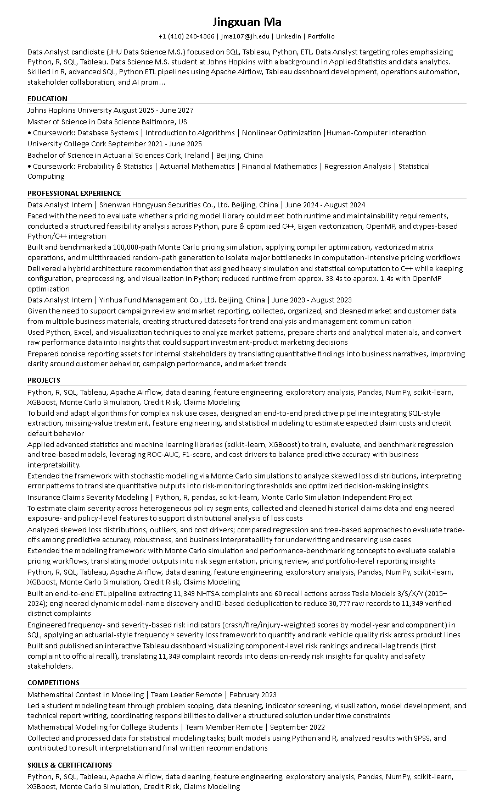
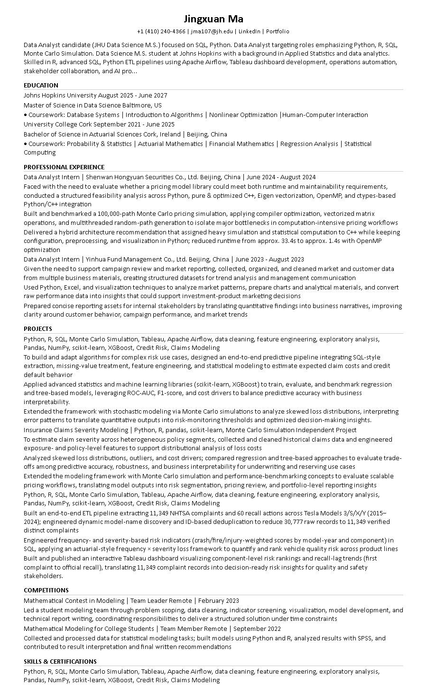
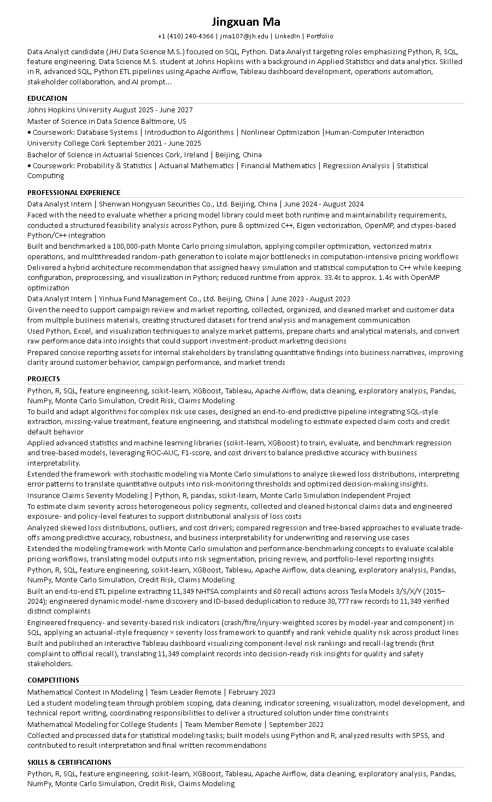
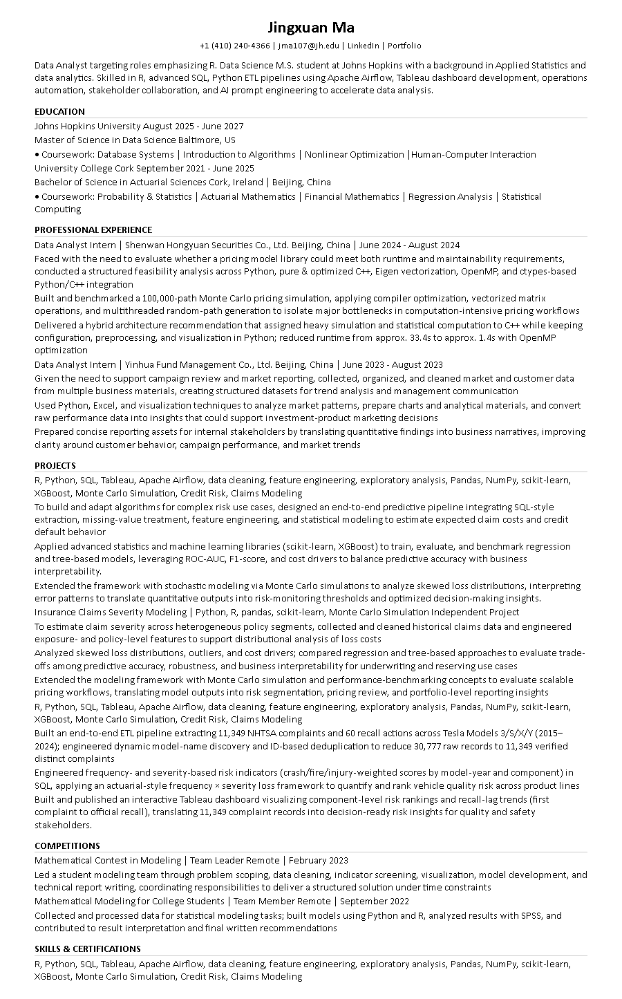

# RG round-0 Summary

- format_pass: 10/10
- avg format/match/honesty: 10.0 / 9.6 / 10.0

## jd01_da_sql_tableau
- scores: {'format': 10, 'match': 10, 'honesty': 10, 'one_page_heuristic': 10}
- format_ok: True errors=[]
- notes: Format lock OK (paragraph/style fingerprint).
- 

## jd02_analytics_engineer
- scores: {'format': 10, 'match': 10, 'honesty': 10, 'one_page_heuristic': 10}
- format_ok: True errors=[]
- notes: Format lock OK (paragraph/style fingerprint).
- 

## jd03_risk_analyst
- scores: {'format': 10, 'match': 10, 'honesty': 10, 'one_page_heuristic': 10}
- format_ok: True errors=[]
- notes: Format lock OK (paragraph/style fingerprint).
- 

## jd04_quant_analytics
- scores: {'format': 10, 'match': 10, 'honesty': 10, 'one_page_heuristic': 10}
- format_ok: True errors=[]
- notes: Format lock OK (paragraph/style fingerprint).
- 

## jd05_bi_analyst
- scores: {'format': 10, 'match': 10, 'honesty': 10, 'one_page_heuristic': 10}
- format_ok: True errors=[]
- notes: Format lock OK (paragraph/style fingerprint).
- 

## jd06_junior_ds
- scores: {'format': 10, 'match': 10, 'honesty': 10, 'one_page_heuristic': 10}
- format_ok: True errors=[]
- notes: Format lock OK (paragraph/style fingerprint).
- 

## jd07_short_jd
- scores: {'format': 10, 'match': 10, 'honesty': 10, 'one_page_heuristic': 10}
- format_ok: True errors=[]
- notes: Format lock OK (paragraph/style fingerprint).
- 

## jd08_long_jd
- scores: {'format': 10, 'match': 10, 'honesty': 10, 'one_page_heuristic': 10}
- format_ok: True errors=[]
- notes: Format lock OK (paragraph/style fingerprint).
- 

## jd09_weak_match
- scores: {'format': 10, 'match': 6, 'honesty': 10, 'one_page_heuristic': 10}
- format_ok: True errors=[]
- notes: Format lock OK (paragraph/style fingerprint).; Match weak or intentionally honest for off-target JD.
- 

## jd10_ops_analytics
- scores: {'format': 10, 'match': 10, 'honesty': 10, 'one_page_heuristic': 10}
- format_ok: True errors=[]
- notes: Format lock OK (paragraph/style fingerprint).
- 
