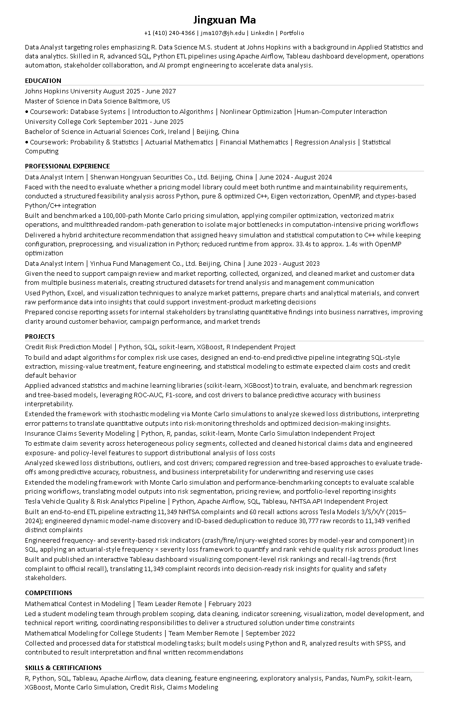

# RG round-1 Summary

- format_pass: 0/10
- avg format/match/honesty: 4.0 / 9.6 / 10.0

## jd01_da_sql_tableau
- scores: {'format': 4, 'match': 10, 'honesty': 10, 'one_page_heuristic': 10}
- format_ok: False errors=['missing_experience_company:Shenwan Hongyuan Securities Co., Ltd.', 'missing_experience_company:Yinhua Fund Management Co., Ltd.']
- notes: FORMAT FAIL — content score discarded until format lock fixed.
- 

## jd02_analytics_engineer
- scores: {'format': 4, 'match': 10, 'honesty': 10, 'one_page_heuristic': 10}
- format_ok: False errors=['missing_experience_company:Shenwan Hongyuan Securities Co., Ltd.', 'missing_experience_company:Yinhua Fund Management Co., Ltd.']
- notes: FORMAT FAIL — content score discarded until format lock fixed.
- 

## jd03_risk_analyst
- scores: {'format': 4, 'match': 10, 'honesty': 10, 'one_page_heuristic': 10}
- format_ok: False errors=['missing_experience_company:Shenwan Hongyuan Securities Co., Ltd.', 'missing_experience_company:Yinhua Fund Management Co., Ltd.']
- notes: FORMAT FAIL — content score discarded until format lock fixed.
- 

## jd04_quant_analytics
- scores: {'format': 4, 'match': 10, 'honesty': 10, 'one_page_heuristic': 10}
- format_ok: False errors=['missing_experience_company:Shenwan Hongyuan Securities Co., Ltd.', 'missing_experience_company:Yinhua Fund Management Co., Ltd.']
- notes: FORMAT FAIL — content score discarded until format lock fixed.
- 

## jd05_bi_analyst
- scores: {'format': 4, 'match': 10, 'honesty': 10, 'one_page_heuristic': 10}
- format_ok: False errors=['missing_experience_company:Shenwan Hongyuan Securities Co., Ltd.', 'missing_experience_company:Yinhua Fund Management Co., Ltd.']
- notes: FORMAT FAIL — content score discarded until format lock fixed.
- 

## jd06_junior_ds
- scores: {'format': 4, 'match': 10, 'honesty': 10, 'one_page_heuristic': 10}
- format_ok: False errors=['missing_experience_company:Shenwan Hongyuan Securities Co., Ltd.', 'missing_experience_company:Yinhua Fund Management Co., Ltd.']
- notes: FORMAT FAIL — content score discarded until format lock fixed.
- 

## jd07_short_jd
- scores: {'format': 4, 'match': 10, 'honesty': 10, 'one_page_heuristic': 10}
- format_ok: False errors=['missing_experience_company:Shenwan Hongyuan Securities Co., Ltd.', 'missing_experience_company:Yinhua Fund Management Co., Ltd.']
- notes: FORMAT FAIL — content score discarded until format lock fixed.
- 

## jd08_long_jd
- scores: {'format': 4, 'match': 10, 'honesty': 10, 'one_page_heuristic': 10}
- format_ok: False errors=['missing_experience_company:Shenwan Hongyuan Securities Co., Ltd.', 'missing_experience_company:Yinhua Fund Management Co., Ltd.']
- notes: FORMAT FAIL — content score discarded until format lock fixed.
- 

## jd09_weak_match
- scores: {'format': 4, 'match': 6, 'honesty': 10, 'one_page_heuristic': 10}
- format_ok: False errors=['missing_experience_company:Shenwan Hongyuan Securities Co., Ltd.', 'missing_experience_company:Yinhua Fund Management Co., Ltd.']
- notes: FORMAT FAIL — content score discarded until format lock fixed.; Match weak or intentionally honest for off-target JD.
- 

## jd10_ops_analytics
- scores: {'format': 4, 'match': 10, 'honesty': 10, 'one_page_heuristic': 10}
- format_ok: False errors=['missing_experience_company:Shenwan Hongyuan Securities Co., Ltd.', 'missing_experience_company:Yinhua Fund Management Co., Ltd.']
- notes: FORMAT FAIL — content score discarded until format lock fixed.
- 
