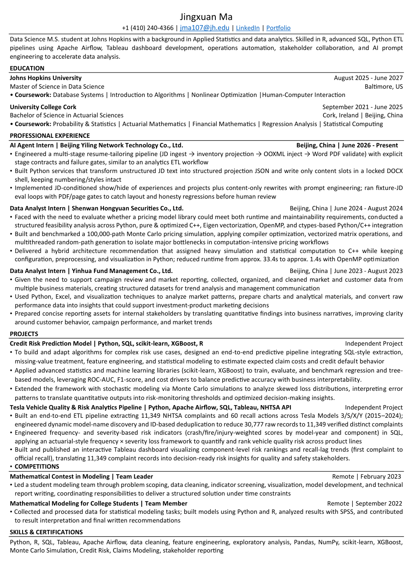
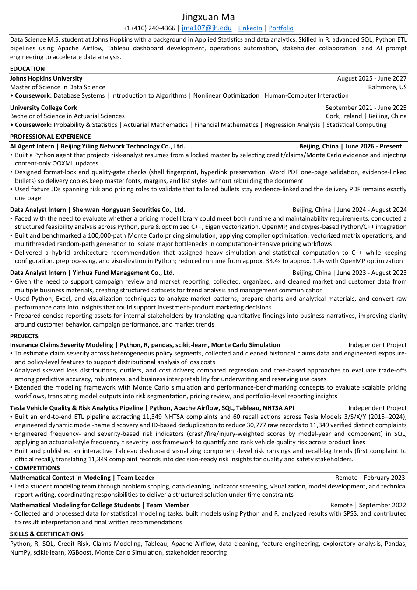
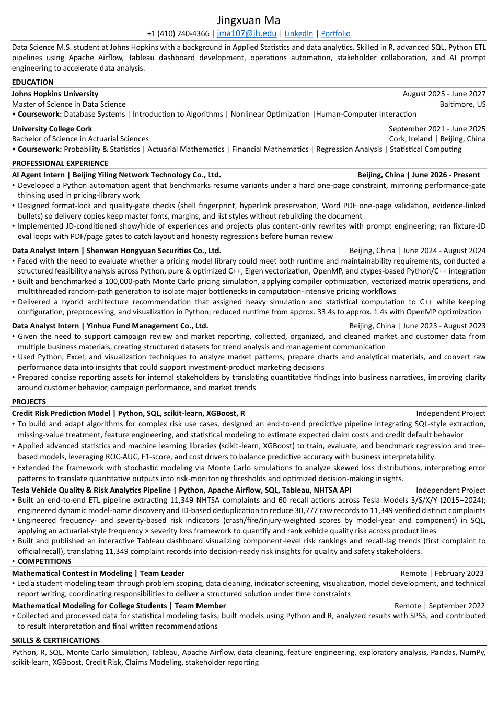
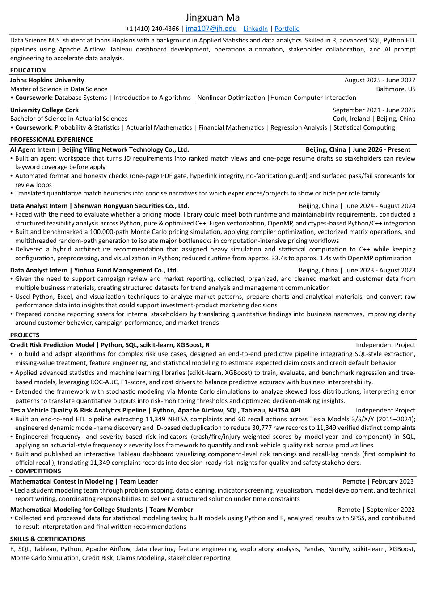
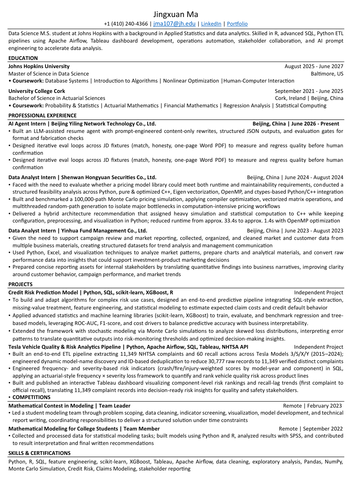
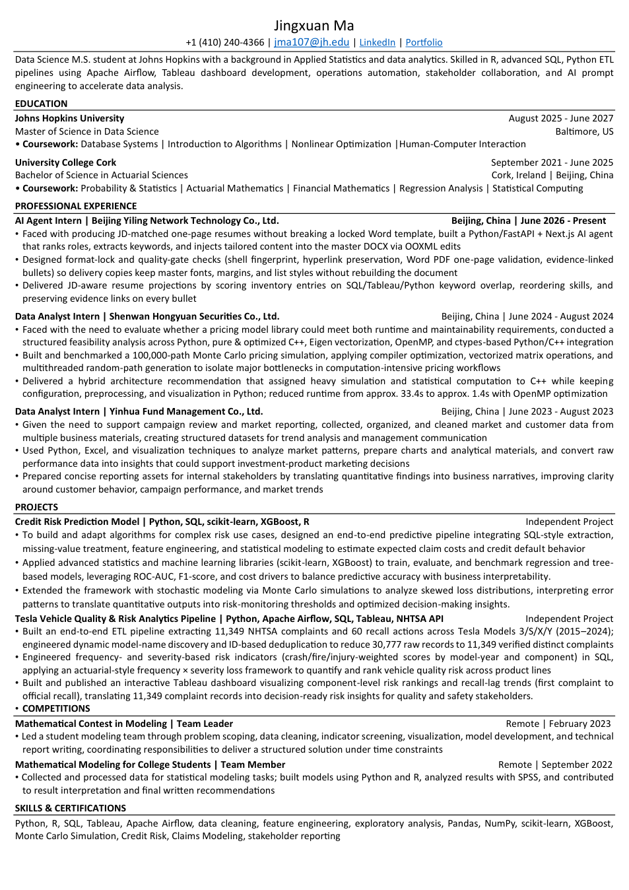
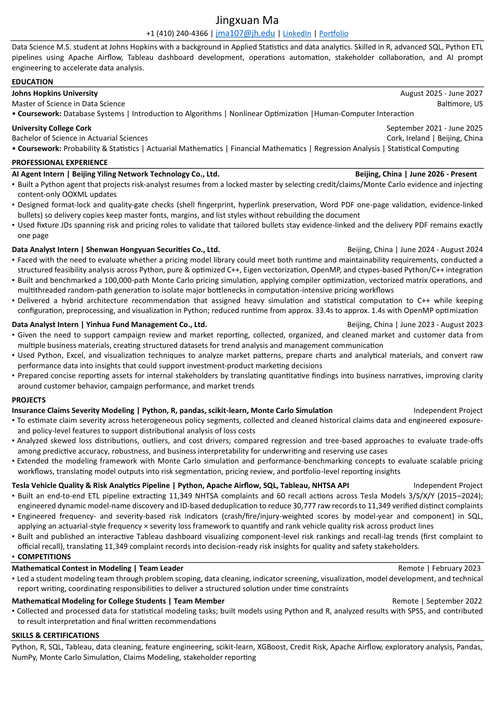
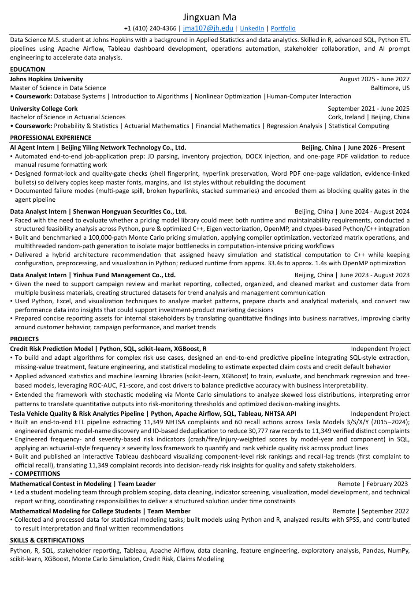

# RG round-6b Summary

- identity_pages: 1
- format_pass: 10/10
- avg format/match/honesty: 10.0 / 9.6 / 10.0

PDF/preview are **Word COM** exports (not HTML).

## jd01_da_sql_tableau
- pdf_pages: 1
- format_ok: True errors=[]
- notes: Word PDF 1-page + hyperlinks OK.
- 

## jd02_analytics_engineer
- pdf_pages: 1
- format_ok: True errors=[]
- notes: Word PDF 1-page + hyperlinks OK.
- 

## jd03_risk_analyst
- pdf_pages: 1
- format_ok: True errors=[]
- notes: Word PDF 1-page + hyperlinks OK.
- 

## jd04_quant_analytics
- pdf_pages: 1
- format_ok: True errors=[]
- notes: Word PDF 1-page + hyperlinks OK.
- 

## jd05_bi_analyst
- pdf_pages: 1
- format_ok: True errors=[]
- notes: Word PDF 1-page + hyperlinks OK.
- 

## jd06_junior_ds
- pdf_pages: 1
- format_ok: True errors=[]
- notes: Word PDF 1-page + hyperlinks OK.
- 

## jd07_short_jd
- pdf_pages: 1
- format_ok: True errors=[]
- notes: Word PDF 1-page + hyperlinks OK.
- 

## jd08_long_jd
- pdf_pages: 1
- format_ok: True errors=[]
- notes: Word PDF 1-page + hyperlinks OK.
- 

## jd09_weak_match
- pdf_pages: 1
- format_ok: True errors=[]
- notes: Word PDF 1-page + hyperlinks OK.; Match weak or intentionally honest for off-target JD.
- 

## jd10_ops_analytics
- pdf_pages: 1
- format_ok: True errors=[]
- notes: Word PDF 1-page + hyperlinks OK.
- 
